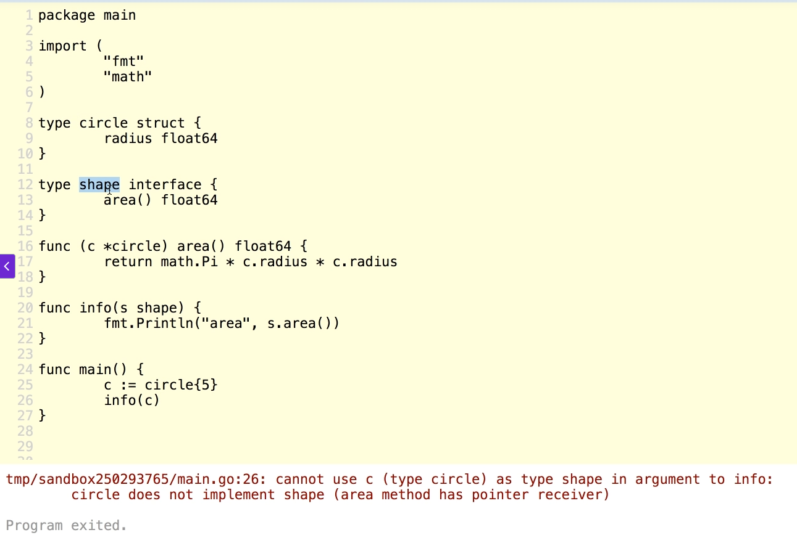
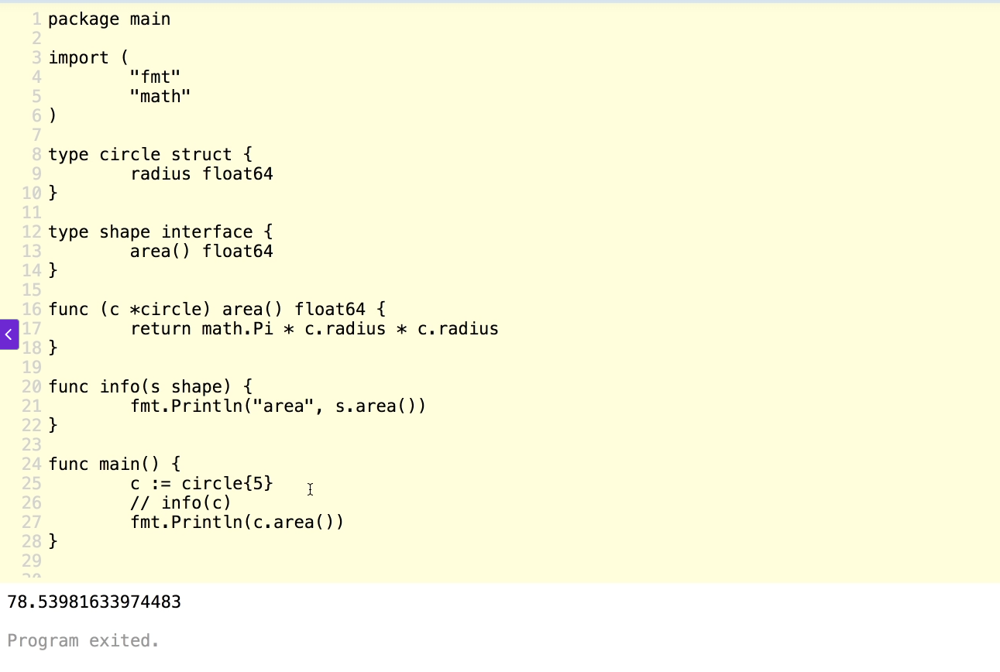

# Revisited method sets
```
Receivers     Values
----------------------
(t T)           T and *T
(t *T)          *T
```

# Method sets
- A type may have a method set associated with it.

Here’s an example in Go that demonstrates how a type can have a method set associated with it:

```go
package main

import "fmt"

// Define a struct type
type Person struct {
	Name string
	Age  int
}

// Method with a value receiver
func (p Person) Greet() {
	fmt.Printf("Hello, my name is %s and I am %d years old.\n", p.Name, p.Age)
}

// Method with a pointer receiver
func (p *Person) HaveBirthday() {
	p.Age++
}

func main() {
	// Create a Person instance
	p := Person{Name: "Alice", Age: 30}

	// Call the method with a value receiver
	p.Greet() // Works with both Person and *Person

	// Call the method with a pointer receiver
	p.HaveBirthday() // Requires *Person, but Go automatically takes the address
	p.Greet()        // Age is updated because HaveBirthday modified the struct
}
```

### Explanation of Method Sets
1. **Value Receiver (`Greet`)**:
   - This method is part of the method set for both `Person` and `*Person`.
   - It can be called on both a value (`p`) and a pointer (`&p`).

2. **Pointer Receiver (`HaveBirthday`)**:
   - This method is part of the method set only for `*Person`.
   - It modifies the struct, so it requires a pointer to the struct.

### Output
```
Hello, my name is Alice and I am 30 years old.
Hello, my name is Alice and I am 31 years old.
```

# Important:
- "The method set of a type determines the INTERFACES that the type implements..."
Câu nói mà giáo viên của bạn nhấn mạnh:

> **"The method set of a type determines the INTERFACES that the type implements..."**

là một khái niệm cốt lõi trong Go liên quan đến **method set**, **interfaces**, và cách Go xử lý tính đa hình (polymorphism). Mình sẽ giải thích thật dễ hiểu, dùng ví dụ thực tế, và đảm bảo bạn không chỉ hiểu mà còn thấy nó "thấm". Nếu cần, mình sẽ liên hệ với đoạn code ở câu hỏi trước để bạn dễ hình dung. Let’s go, bro! 😎

---

### **1. Hiểu từng phần của câu nói**

#### **a. "Method set of a type"**
- **Method set** là tập hợp tất cả các **method** được định nghĩa cho một kiểu dữ liệu (type) trong Go.
- Trong Go, bạn có thể định nghĩa method cho:
  - **Named types** (kiểu tự định nghĩa, ví dụ `struct` hoặc `type MyInt int`).
  - **Pointer types** (con trỏ tới kiểu, ví dụ `*MyStruct`).
- Method set phụ thuộc vào việc method được định nghĩa với **receiver** là **giá trị** (`T`) hay **con trỏ** (`*T`).

**Ví dụ đơn giản**:
```go
type Person struct {
    Name string
}

// Method với receiver là giá trị
func (p Person) SayHello() {
    fmt.Println("Hello, I'm", p.Name)
}

// Method với receiver là con trỏ
func (p *Person) ChangeName(newName string) {
    p.Name = newName
}
```
- Method set của `Person` bao gồm: `SayHello`.
- Method set của `*Person` bao gồm: `SayHello` và `ChangeName`.

**Quy tắc quan trọng** (giáo viên muốn bạn nhớ):
- Nếu method có receiver là `T`, thì method đó thuộc method set của **cả** `T` và `*T`.
- Nếu method có receiver là `*T`, thì method đó **chỉ** thuộc method set của `*T`.

#### **b. "Determines the INTERFACES that the type implements"**
- **Interface** trong Go là một tập hợp các method mà một kiểu dữ liệu phải có để "thỏa mãn" (implement) interface đó.
- Một kiểu dữ liệu được coi là implement một interface nếu **method set** của nó chứa **tất cả** các method được khai báo trong interface (với cùng tên và chữ ký).

**Ví dụ interface**:
```go
type Greeter interface- Interface định nghĩa một method
type Greeter interface {
    SayHello()
}
```
- Bất kỳ kiểu nào có method `SayHello()` trong method set của nó sẽ tự động implement interface `Greeter`.

**Kết nối với method set**:
- Nếu `Person` có method `SayHello`, thì `Person` (và `*Person`) implement `Greeter`.
- Nếu một interface yêu cầu method `ChangeName`, chỉ `*Person` implement interface đó (vì `ChangeName` chỉ có trong method set của `*Person`).

---

### **2. Tại sao câu này quan trọng?**
Câu này nhấn mạnh rằng trong Go, việc một kiểu dữ liệu có implement một interface hay không được quyết định **tự động** bởi **method set** của nó. Không cần khai báo rõ ràng (như trong các ngôn ngữ khác, ví dụ Java với từ khóa `implements`). Điều này làm cho Go rất linh hoạt nhưng cũng dễ gây nhầm lẫn nếu bạn không hiểu rõ method set.

**Ví dụ thực tế**:
- Hãy tưởng tượng interface như một "hợp đồng" yêu cầu một số kỹ năng (methods).
- Method set của một kiểu là "danh sách kỹ năng" mà kiểu đó có.
- Nếu danh sách kỹ năng của kiểu bao gồm tất cả các kỹ năng trong hợp đồng, kiểu đó tự động ký được hợp đồng (implement interface).

---

### **3. Ánh xạ với ví dụ thực tế**
Hãy tưởng tượng bạn đang tuyển nhân viên cho một công việc cụ thể:

- **Interface**: Là mô tả công việc, ví dụ: "Cần biết nấu súp và nướng bánh."
- **Type**: Là một ứng viên (như `Person` hoặc `*Person`).
- **Method set**: Là các kỹ năng của ứng viên (như biết nấu súp, nướng bánh, hoặc rửa bát).

**Tình huống**:
- Công việc yêu cầu: "Phải biết nấu súp (`SayHello`) và nướng bánh (`ChangeName`)."
- Ứng viên `Person` chỉ biết nấu súp (`SayHello`), nên không đủ điều kiện.
- Ứng viên `*Person` biết cả nấu súp (`SayHello`) và nướng bánh (`ChangeName`), nên được nhận (implement interface).

**Go làm gì?**
- Go tự động kiểm tra method set của `Person` và `*Person` để xem ai thỏa mãn "mô tả công việc" (interface) mà không cần bạn phải nói rõ "Tôi implement interface này."

---

### **4. Ví dụ code minh họa**
Dưới đây là đoạn code minh họa đầy đủ để bạn thấy cách method set ảnh hưởng đến việc implement interface:

```go
package main

import "fmt"

// Định nghĩa interface
type Greeter interface {
    SayHello()
}

type NameChanger interface {
    ChangeName(string)
}

// Định nghĩa struct
type Person struct {
    Name string
}

// Method với receiver là giá trị
func (p Person) SayHello() {
    fmt.Println("Hello, I'm", p.Name)
}

// Method với receiver là con trỏ
func (p *Person) ChangeName(newName string) {
    p.Name = newName
}

// Hàm nhận interface để test
func greet(g Greeter) {
    g.SayHello()
}

func changeName(nc NameChanger) {
    nc.ChangeName("New Name")
}

func main() {
    // Tạo instance
    p := Person{Name: "Alice"}
    pp := &Person{Name: "Bob"}

    // Test với Greeter interface
    greet(p)  // OK: Person có SayHello
    greet(pp) // OK: *Person cũng có SayHello

    // Test với NameChanger interface
    // changeName(p)  // LỖI: Person không có ChangeName
    changeName(pp) // OK: *Person có ChangeName

    fmt.Println("After change, Bob's name:", pp.Name)
}
```

**Output**:
```
Hello, I'm Alice
Hello, I'm Bob
After change, Bob's name: New Name
```

**Giải thích**:
- `Person` implement `Greeter` vì có `SayHello`.
- `*Person` implement cả `Greeter` và `NameChanger` vì có cả `SayHello` và `ChangeName`.
- `changeName(p)` sẽ lỗi biên dịch vì `Person` không có `ChangeName` trong method set.

---

### **5. Liên hệ với code ở câu hỏi trước**
Trong đoạn code về `WaitGroup` và goroutines trước đó, tuy không dùng interface trực tiếp, bạn có thể thấy khái niệm method set nếu thêm interface. Ví dụ:

```go
type TaskRunner interface {
    Run()
}

func (t *Task) Run() {
    computeSumOfSquares(t.numbers, t.name)
}
```

- Nếu bạn định nghĩa `Task` với method `Run`, thì `*Task` sẽ implement `TaskRunner`.
- Bạn có thể viết hàm nhận `TaskRunner` để chạy các tác vụ, và chỉ `*Task` (không phải `Task`) sẽ thỏa mãn interface nếu `Run` dùng pointer receiver.

---

### **6. Tại sao giáo viên nhấn mạnh?**
- **Dễ nhầm lẫn**: Nhiều người mới học Go không hiểu tại sao `*T` implement interface mà `T` không implement (hoặc ngược lại). Điều này liên quan trực tiếp đến method set.
- **Tính linh hoạt của Go**: Hiểu method set giúp bạn thiết kế code linh hoạt, tận dụng interface để viết code tổng quát (generic) mà không cần kế thừa (inheritance).
- **Tránh lỗi**: Nếu không hiểu method set, bạn có thể gặp lỗi biên dịch khó hiểu khi dùng interface, đặc biệt khi trộn giá trị và con trỏ.

---

### **7. Mẹo để nhớ**
- **Method set như danh sách kỹ năng**: Kiểu nào có đủ "kỹ năng" (method) mà interface yêu cầu, kiểu đó tự động thỏa mãn interface.
- **Pointer vs Value**: Luôn kiểm tra receiver của method (`T` hay `*T`) để biết method set của kiểu.
- **Go tự động kiểm tra**: Không cần khai báo `implements`, Go dựa vào method set để quyết định.

---

### **8. Kết luận**
Câu nói của giáo viên là chìa khóa để hiểu cách Go xử lý interface và polymorphism. Nó nhấn mạnh rằng **method set** là yếu tố quyết định một kiểu có implement interface hay không, và điều này ảnh hưởng lớn đến cách bạn thiết kế code. Với ví dụ "tuyển nhân viên" và đoạn code minh họa, hy vọng bạn đã thấy nó dễ hiểu hơn.

Nếu bạn muốn mình đào sâu thêm (ví dụ: thêm case phức tạp hơn hoặc liên hệ với code `WaitGroup`), cứ nói nhé, bro! 😎


# Explain this image, why code is not working!


- If you are not findout. See this images. Method set determines the interfaces that the type implements


- I don't know, lets figure out together!