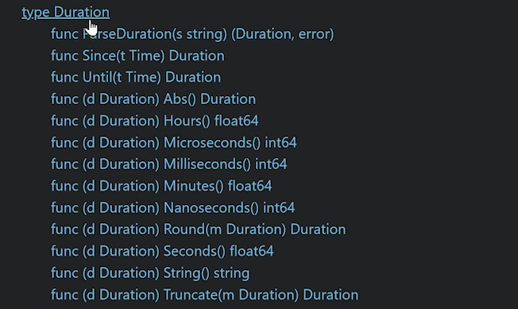

### Course info
- https://www.udemy.com/course/learn-how-to-code/learn/lecture/37577544

### Builtin:
- https://pkg.go.dev/builtin

### Specification:
- https://go.dev/ref/spec

### Some notes:
- In Go you don't create classes, you create a **TYPE**
- In Go you don't instantiate, you create a **VALUE** of a **TYPE**
- Each type have multiples method/func inside it
