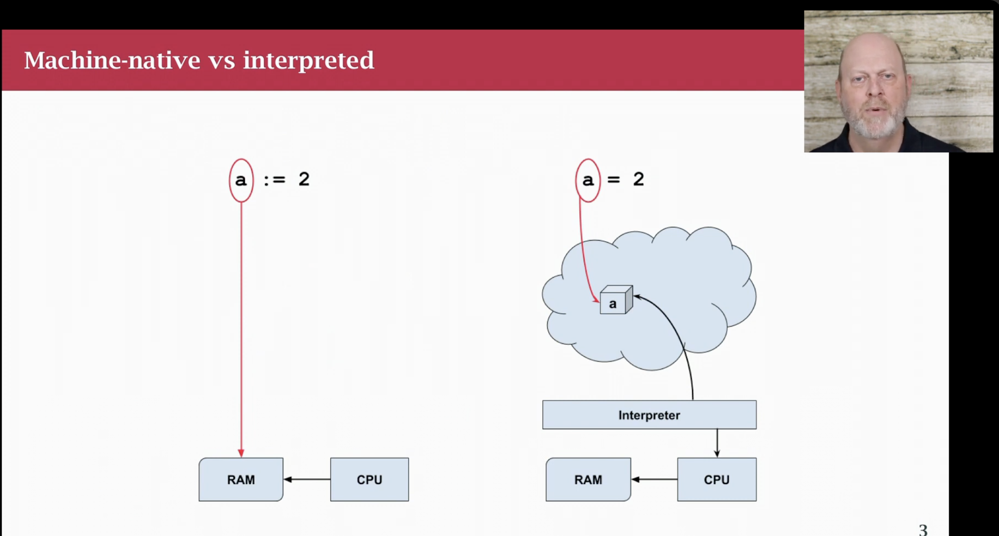

### Compiled vs Interpreted

Haha, I really don't understand before, but not fucking now!

So compiled language is the way you need to compile code before it runs, and a highlight in go that if code is error, you can not compile it so you can detect issue earlier.

Interpreted language, I can give an example like Python, you can run directly without compile it, you only see error if you run it and reached the error line. If your code have error line but you haven't reached it, you can't see error xDD

I would put a image here to clarify it, took from youtube series in this folder

### Initilization

Go init all values to "zero" by default.

Here is some different "zero" values by type:

- int, float = 0
- strings = ""
- bool = false
- slices,pointers,maps,channels, functions (func variable), interfaces = nil

### Const
only numbers, strings, booleans can be constants (immuetable!)

Why, because go is concurrency programming language, so it need to be immutable!